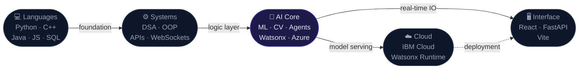
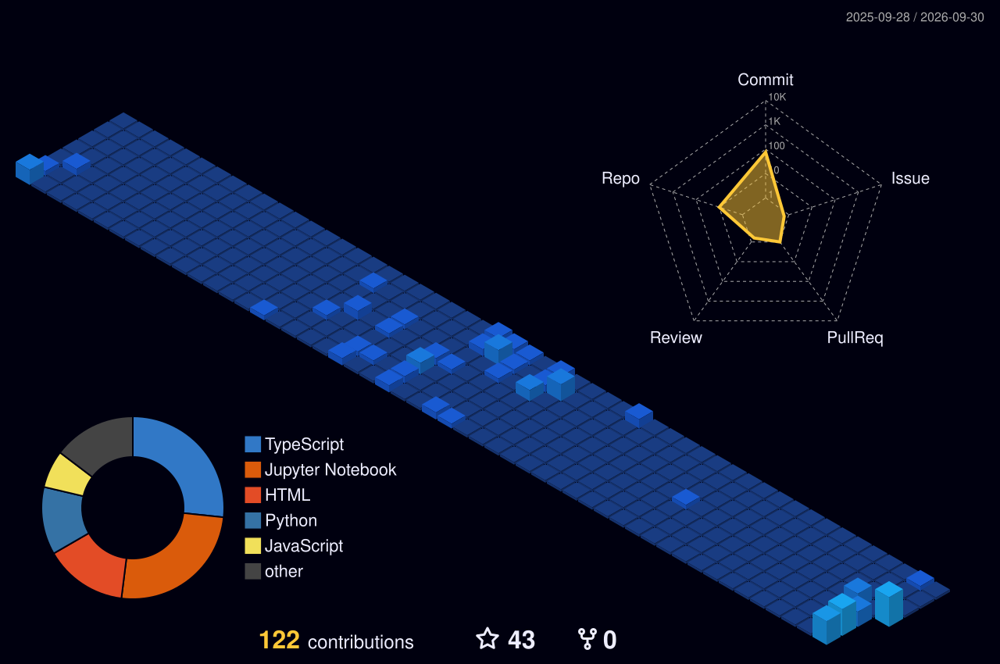

<div align="center">




<br/>

[](https://www.linkedin.com/in/tushar-kapoor-143484333/)
[](https://leetcode.com/u/tusharkapoor66/)
[](https://github.com/Tusharkapoor-oop/Kapoor-portfolio)
[](https://tusharkapoor-oop.github.io/)

<br/>


</div>

<br/>

```python
# ── Identity ──────────────────────────────────────────────────────────
name       = "Tushar Kapoor"
university = "B.Tech CSE (AI & ML) · K.R. Mangalam University"
location   = "Gurugram, India"
direction  = "Computer Vision → Cloud AI → Intelligent Systems"

# ── Engineering Philosophy ────────────────────────────────────────────
principle  = [
    "Understand the system before writing the code.",
    "Document the decision, not just the implementation.",
    "Algorithmic precision over heavyweight abstraction.",
    "Ship real work. Measure real results.",
]
```

---

<br/>

### `01 /` Engineering  <sub><sup>auto-updates daily</sup></sub>

<!-- REPOS:START -->
```
  REPOSITORY                           LANGUAGE       TYPE            ⭐  UPDATED
  ─────────────────────────────────────────────────────────────────────────────────────
  Advance_hand_gesture                 JavaScript     Vision          4★  today
                                       └─ Real-time hand-gesture recognition - MediaPipe landmarks, Te..
  auracontrol-backend                  TypeScript     Vision          4★  today
                                       └─ Real-time hand-gesture recognition backend (AuraControl) - F..
  VOIS_AICTE_Oct2025_TUSHAR-KAPOOR     Jupyter Notebook Data            4★  today
                                       └─ Netflix and Airbnb data analysis - EDA notebooks, decks, and..
  OS_LAB_Linux_Ubantu                  Python         Backend         4★  today
                                       └─ Operating Systems lab in Python - system calls, CPU scheduli..
  go-bric                              TypeScript     Frontend        4★  today
                                       └─ Multi-agent company scouting on Next.js and Gemini - five sp..
  ReflectAI                            Jupyter Notebook Engineering     4★  today
                                       └─ Deterministic end-of-day reflection tool - structured conver..
  Sustainable-Agriculture-Project      Jupyter Notebook AI/ML           4★  today
                                       └─ Crop recommendation from soil/climate features - full ML pip..
  tushar_cse-AI-and-ML-A_AI-STUDY-PL.. HTML           Backend         6★  today
                                       └─ This project is an AI-based Study Planner designed to help s..
  Kapoor-portfolio                     TypeScript     Frontend        1★  today
                                       └─ Personal portfolio website - React, Vite and Tailwind with G..
  NPU-Fit-Checker-Automated-NPU-Fall.. Python         Engineering     4★  today
                                       └─ Automated NPU fallback diagnosis - find which layers fell ba..
  IBM-Cloud-project                    Jupyter Notebook AI/ML           4★  today
                                       └─ Predictive maintenance on IBM Cloud / Watsonx - Jupyter ML p..
```

<details>
<summary><sub>View repository links</sub></summary>
<br/>

**[Advance_hand_gesture](https://github.com/Tusharkapoor-oop/Advance_hand_gesture)** &nbsp;·&nbsp; `Vision` &nbsp;·&nbsp; ⭐ 4
<br/><sub>Real-time hand-gesture recognition - MediaPipe landmarks, TensorFlow classifier, browser demo</sub>

**[auracontrol-backend](https://github.com/Tusharkapoor-oop/auracontrol-backend)** &nbsp;·&nbsp; `Vision` &nbsp;·&nbsp; ⭐ 4
<br/><sub>Real-time hand-gesture recognition backend (AuraControl) - FastAPI, MediaPipe, WebSocket</sub>

**[VOIS_AICTE_Oct2025_TUSHAR-KAPOOR](https://github.com/Tusharkapoor-oop/VOIS_AICTE_Oct2025_TUSHAR-KAPOOR)** &nbsp;·&nbsp; `Data` &nbsp;·&nbsp; ⭐ 4
<br/><sub>Netflix and Airbnb data analysis - EDA notebooks, decks, and course materials.</sub>

**[OS_LAB_Linux_Ubantu](https://github.com/Tusharkapoor-oop/OS_LAB_Linux_Ubantu)** &nbsp;·&nbsp; `Backend` &nbsp;·&nbsp; ⭐ 4
<br/><sub>Operating Systems lab in Python - system calls, CPU scheduling, synchronization, memory, file systems.</sub>

**[go-bric](https://github.com/Tusharkapoor-oop/go-bric)** &nbsp;·&nbsp; `Frontend` &nbsp;·&nbsp; ⭐ 4
<br/><sub>Multi-agent company scouting on Next.js and Gemini - five specialist agents over a shared dataset.</sub>

**[ReflectAI](https://github.com/Tusharkapoor-oop/ReflectAI)** &nbsp;·&nbsp; `Engineering` &nbsp;·&nbsp; ⭐ 4
<br/><sub>Deterministic end-of-day reflection tool - structured conversation to a psychological tree output.</sub>

**[Sustainable-Agriculture-Project](https://github.com/Tusharkapoor-oop/Sustainable-Agriculture-Project)** &nbsp;·&nbsp; `AI/ML` &nbsp;·&nbsp; ⭐ 4
<br/><sub>Crop recommendation from soil/climate features - full ML pipeline with preprocessing and evaluation.</sub>

**[tushar_cse-AI-and-ML-A_AI-STUDY-PLANNER](https://github.com/Tusharkapoor-oop/tushar_cse-AI-and-ML-A_AI-STUDY-PLANNER)** &nbsp;·&nbsp; `Backend` &nbsp;·&nbsp; ⭐ 6
<br/><sub>This project is an AI-based Study Planner designed to help students automatically generate  study plans and find relevant educational videos.  The project consists of both frontend and backend components.  The user interacts with the system by uploading a syllabus, which is processed to extract  key topics.</sub>

**[Kapoor-portfolio](https://github.com/Tusharkapoor-oop/Kapoor-portfolio)** &nbsp;·&nbsp; `Frontend` &nbsp;·&nbsp; ⭐ 1
<br/><sub>Personal portfolio website - React, Vite and Tailwind with GitHub Actions CI/CD</sub>

**[NPU-Fit-Checker-Automated-NPU-Fallback-Diagnosis](https://github.com/Tusharkapoor-oop/NPU-Fit-Checker-Automated-NPU-Fallback-Diagnosis)** &nbsp;·&nbsp; `Engineering` &nbsp;·&nbsp; ⭐ 4
<br/><sub>Automated NPU fallback diagnosis - find which layers fell back to CPU, on which target, and why.</sub>

**[IBM-Cloud-project](https://github.com/Tusharkapoor-oop/IBM-Cloud-project)** &nbsp;·&nbsp; `AI/ML` &nbsp;·&nbsp; ⭐ 4
<br/><sub>Predictive maintenance on IBM Cloud / Watsonx - Jupyter ML pipeline with training and evaluation notebooks</sub>

</details>

<sub><sup>↻ auto-updated · 2026-09-30 16:25 UTC</sup></sub>
<!-- REPOS:END -->

<br/>


<br/>

---

### `02 /` Selected Systems

<div align="center">

| System | What it does | Signal |
| :---: | --- | :---: |
| [**NPU Fit Checker**](https://github.com/Tusharkapoor-oop/NPU-Fit-Checker-Automated-NPU-Fallback-Diagnosis) | Traces which layers silently fall back from NPU → CPU, per execution provider, with evidence-linked diagnosis | **30/30 tests green** |
| [**AuraControl**](https://github.com/Tusharkapoor-oop/auracontrol-backend) | Real-time gesture engine — MediaPipe landmarks → classifier → FastAPI / WebSocket dispatch loop | **streaming backend** |
| [**go-bric**](https://github.com/Tusharkapoor-oop/go-bric) | Multi-agent company scouting — five specialist agents collaborating over one shared dataset | **Next.js + Gemini, deployed** |

<sub><sup>…and 8 more systems, auto-listed above ↑</sup></sub>

</div>

<br/>

---

### `03 /` Intelligence Stack

<div align="center">
  
</div>



<div align="center">
  <br/>
  <sub><sup>LANGUAGES</sup></sub><br/><br/>
  <br/>
  <sub><sup>AI · ENGINEERING · TOOLS</sup></sub><br/><br/>
  <br/>
  <sub><sup>CLOUD · SYSTEMS · ENVIRONMENT</sup></sub>
</div>

```
BUILDING       Python · C++ · JavaScript · FastAPI · React · OpenCV
WORKING WITH   IBM Watsonx.ai · Azure AI · TensorFlow · MediaPipe
LEARNING       Transformer architectures · C++ systems programming
EXPERIMENTING  Generative model integration · Multimodal AI systems
```

<br/>

---

### `04 /` Proof

```
GO BRICS International Internship   ──  1st Place · Letter of Recommendation
GO BRICS International Hackathon    ──  Qualified
Dean's Honour Award                 ──  K.R. Mangalam University
Azure AI Fundamentals               ──  Microsoft
Cisco Cybersecurity                 ──  Cisco Networking Academy
IBM SkillsBuild AI & Cloud          ──  Edunet / IBM
Deloitte Technology Simulation      ──  Deloitte Australia
```

<br/>

---

### `05 /` Activity

<div align="center">
  
</div>

<br/>

<div align="center">
  
</div>

<br/>

<div align="center">
  
  
</div>

<br/>

<div align="center">
  
</div>

<br/>

<div align="center">
  
</div>

<br/>

---

```python
# ── Currently ─────────────────────────────────────────────────────────
building   = "AuraControl gesture engine · air-signature refinement"
exploring  = ["Multimodal AI systems", "Generative model integration"]
studying   = ["Transformer architectures", "C++ systems programming"]
open_to    = ["Internships", "Hackathons", "Research collaboration"]
```

<div align="center">
<br/>

</div>
