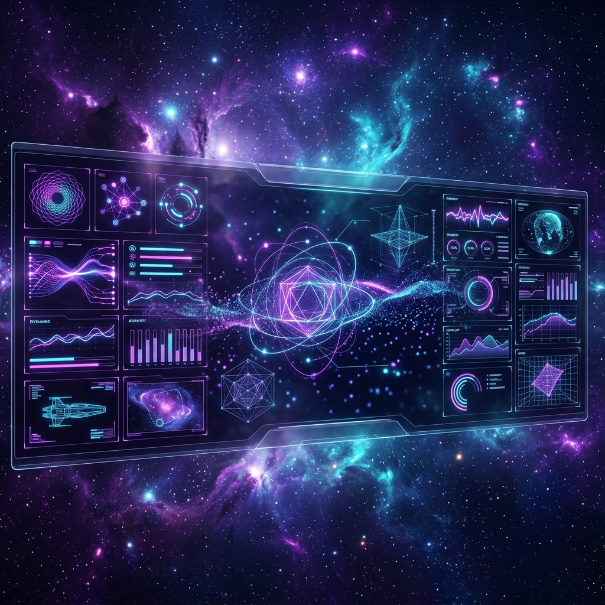

  

 
 

  
  
  

---

<table align="center" width="100%" style="border-collapse: collapse; border: none;">
  <tr>
    <td width="50%" valign="top" style="border: none;">
      <h3 align="center">✦ Core Systems</h3>
       
      

        
      

    </td>
    <td width="50%" valign="top" style="border: none;">
      <h3 align="center">✦ AI Intelligence</h3>
       
      

        
      

    </td>
  </tr>
</table>

---

  <h3>⟪ Deep Space Telemetry ⟫</h3>

  
  

 

  

 

---

<table align="center" width="100%" style="border: none;">
  <tr>
    <td width="50%" valign="top" style="border: none;">
      <h3>✦ Flagship Modules</h3>
      <ul>
        <li><b><a href="https://github.com/Tusharkapoor-oop/Advance_hand_gesture">AuraControl: Contactless UI</a></b> <i>Computer Vision • WebSocket • Gesture Recognition</i> Translates hand landmarks into real-time computer actions.</li>
         
        <li><b><a href="https://github.com/Tusharkapoor-oop/IBM-Cloud-project">AI Health & Nutrition Agent</a></b> <i>IBM watsonx • Conversational AI • Python</i> LLM-powered agent mapping intelligent responses.</li>
      </ul>
    </td>
    <td width="50%" valign="top" style="border: none;">
      <h3>✦ Activity Stream</h3>
      
    </td>
  </tr>
</table>

 

  

